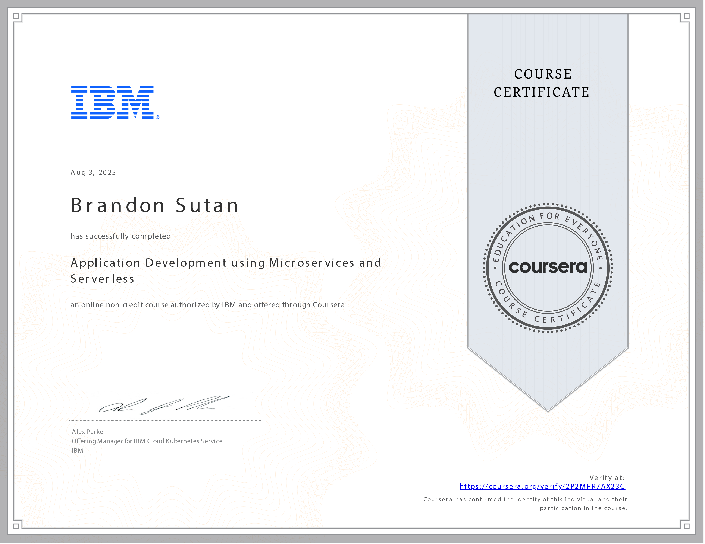

# Application Development using Microservices and Serverless - Course Reflection

## Unveiling the Future: Reflecting on Application Development with Microservices and Serverless

As I complete the **Application Development using Microservices and Serverless** course, I am empowered by the knowledge and skills gained throughout this 14-hour transformative journey. This course has given me a deep understanding of modern software architecture paradigms and their practical application.

## Unleashing the Power: Microservices and Their Advantages

Throughout the course, I dived into the fundamentals of microservices and explored their advantages over monolithic architectures. Understanding how to break down complex applications into smaller, manageable services has expanded my horizon as a developer, allowing me to build more scalable and maintainable solutions.

## Forging Connections: Building REST API Endpoints

Creating REST API endpoints and effectively invoking them using tools like cURL and Postman has been a remarkable learning experience. The course equipped me with the skills needed to design, implement, and test APIs, ensuring seamless communication between different software system components.

## Beyond Boundaries: Embracing Serverless Technologies

Embracing serverless technologies using IBM Code Engine was a revelation. I learned how to create and deploy microservices as Docker containers, harnessing the power of serverless computing. The ability to leverage cloud-based environments for development and testing enriched my proficiency as a developer.

## The Journey Continues: Applying Knowledge through Hands-On Practice

One of the course's strengths was its emphasis on hands-on labs and projects. Through a no-charge cloud-based environment, I applied my newfound skills in a real-world context, solidifying my understanding of microservices and serverless architecture.

## Ready to Transform the Future

The **Application Development using Microservices and Serverless** course has equipped me with the tools to shape the future of software development. I am now poised to create innovative solutions that leverage microservices' agility and serverless technologies' efficiency.

Thank you for participating in this transformative journey through microservices and serverless development. With the skills gained, I'm ready to collaborate, innovate, and contribute to a future powered by dynamic, scalable, and efficient software solutions!
