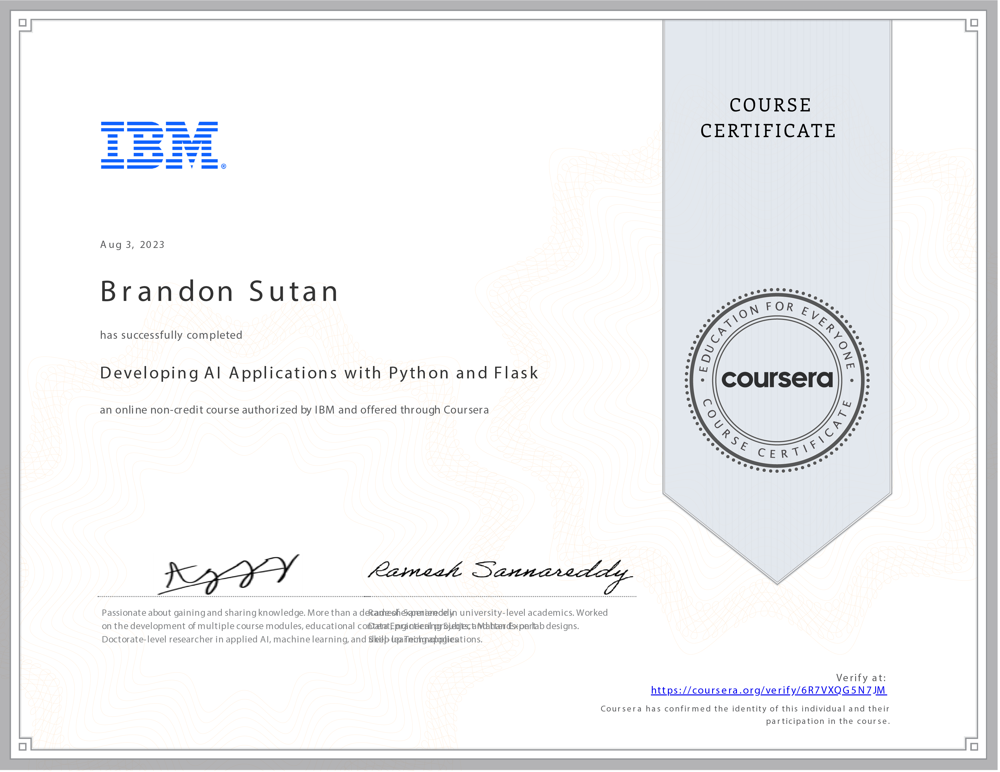

# Developing AI Applications with Python and Flask - Course Reflection

## Unleashing the Power of AI: Reflecting on Python and Flask

Embarking on the **Developing AI Applications with Python and Flask** course has been a captivating journey that has unveiled the incredible potential of artificial intelligence. Over 10 hours, I've delved into Python application development and Flask framework while harnessing the prowess of AI to create impactful web applications.

## Navigating the Application Development Lifecycle

This course has demystified the art of Python application development, guiding me through the intricate steps and processes involved in crafting robust software. I've learned to conceptualize, design, and implement Python applications, ensuring a comprehensive understanding of the application development lifecycle.

## Crafting Python Modules: From Unit Tests to Packaging

The course has equipped me with the skills to create modular, efficient, and well-structured Python code. The ability to run unit tests and adhere to PEP8 coding best practices ensures that my codebase is functional but also maintainable and reliable.

## Flask Unveiled: Deploying Applications on the Web

Mastering Flask has unlocked a realm of possibilities in web application development. I've learned to leverage Flask's features to create interactive and dynamic web applications, effectively transforming ideas into tangible digital experiences that users can engage with.

## AI Integration: Building Intelligent Web Applications

Integrating AI capabilities into web applications was the most exhilarating part of the journey. I've gained the knowledge and skills to create AI-based applications using IBM Watson AI Libraries and Flask. This empowers me to develop applications that can understand, process, and respond intelligently to user interactions.

## Forging Ahead with Python, Flask, and AI

Completing the **Developing AI Applications with Python and Flask** course has ignited a passion for crafting intelligent applications that blend cutting-edge technology with seamless user experiences. With Python prowess, Flask finesse, and AI aptitude, I'm ready to explore new artificial intelligence and web development horizons.

Thank you for joining me on this exciting exploration of AI, Python, Flask and their potential to shape the future of web applications. As I continue my journey, I'm excited to bring the power of intelligent technologies to the fingertips of users worldwide.
