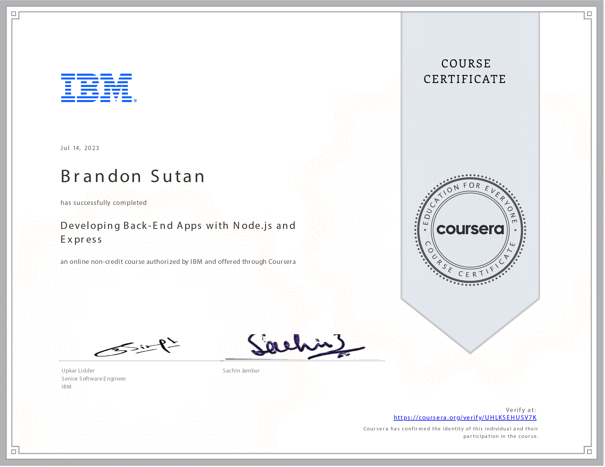

# Developing Back-End Apps with Node.js and Express - Unleashing the Power of Server-Side

## Crafting Robust Back-Ends: A Transformative Journey

Venturing into the realm of **Developing Back-End Apps with Node.js and Express** has been an enlightening odyssey, unraveling the art of crafting dynamic and efficient server-side applications. Through 12 hours of immersive learning, I've harnessed the capabilities of Node.js and Express to create robust back-ends that power modern web applications.

## Embracing the Node.js Runtime: Unveiling Server-Side Magic

This course enabled me to harness the Node.js JavaScript runtime to create server-side applications. The ability to develop server-side logic using JavaScript has broadened my horizons, empowering me to create versatile applications that cater to diverse user needs.

## Extending with Express: Unlocking Endless Possibilities

By mastering the art of extending Node.js applications with the Express framework, I've gained the ability to develop scalable, feature-rich applications. Express's flexibility has enabled me to build APIs, handle routes, and create middleware that optimizes application performance.

## Empowering with npm: Managing Node.js Packages

The course introduced me to the power of npm, allowing me to manage Node.js packages within my applications efficiently. This proficiency has streamlined the integration of third-party libraries and tools, enriching my applications with enhanced functionalities.

## Asynchronous Excellence: Callback Functions and Promises

Developing asynchronous operations using callback functions and promises has been a pivotal learning experience. This expertise has empowered me to create applications that efficiently manage resources, handle multiple tasks concurrently, and ensure seamless user experiences.

## Envisioning a Dynamic Future

Reflecting on my journey through the **Developing Back-End Apps with Node.js and Express** course, I'm excited by the potential to create innovative and efficient server-side applications that cater to modern web development demands. The skills I've gained allow me to shape the digital landscape with robust and dynamic back-ends.
