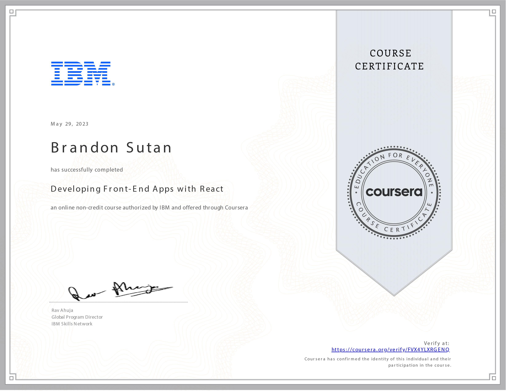

# Developing Front-End Apps with React - Unleashing Dynamic User Experiences

## Crafting Engaging User Interfaces: A Journey into React

Embarking on the adventure of **Developing Front-End Apps with React** has been a transformative experience, igniting my ability to create captivating user interfaces and dynamic web applications. With 13 hours of immersive learning, I've harnessed the power of React, JSX, and ES6 to craft user-centric front-end experiences.

## Building Interactive Interfaces: Unleashing Web Application Magic

This course empowered me to develop interactive user interfaces and web applications using React, JSX, and ES6. The ability to create reusable components has expedited the process of building dynamic websites, allowing me to focus on enhancing user engagement and satisfaction.

## Dynamic Websites at My Fingertips: Reusable React Components

By mastering reusable React components, I've gained the prowess to rapidly construct front-end applications. These components serve as building blocks for creating dynamic websites that cater to modern user expectations and provide seamless interactions.

## Seamless Data Exchange: Communication with External Services

Employing GET, POST, UPDATE, and DELETE requests, I've learned to exchange data with external services seamlessly. This skill has enriched my applications by enabling real-time updates and data synchronization, enhancing user experiences.

## Harnessing React's Power: Props, States, Hooks, and More

Delving into various React concepts and features, including props, states, hooks, forms, and Redux, has broadened my toolkit. These capabilities have enabled me to create adaptable and responsive interfaces that dynamically respond to user interactions.

## Pioneering Front-End Excellence: A Dynamic Future

Reflecting on my journey through the **Developing Front-End Apps with React** course, I am invigorated by the potential to create user-centric web applications that captivate and engage. The skills I've acquired empower me to shape the digital landscape with interfaces that transcend expectations.

Thank you for accompanying me on this enriching journey into the world of front-end development with React. As I move forward, I'm excited to contribute to the evolution of user experiences driven by the boundless creativity of React's capabilities.
