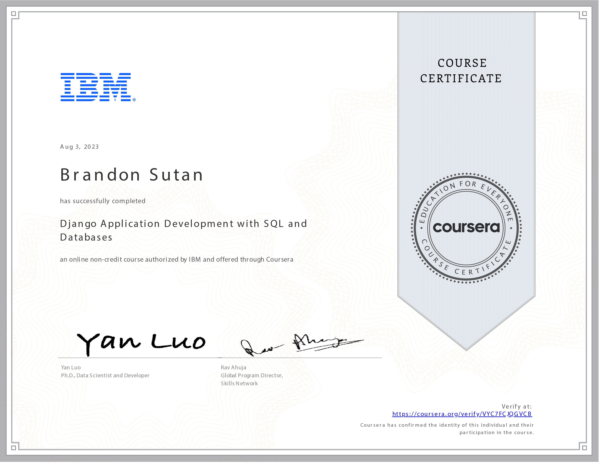

# Django Application Development with SQL and Databases - Course Reflection

## Crafting Dynamic Web Applications: Reflecting on Django and Databases

The **Django Application Development with SQL and Databases** course has been a transformative journey into web application development and database management. Over 14 hours, I've gained the skills to create dynamic and interactive web pages while mastering the art of database design and manipulation.

## Unveiling the Database World: Entity Relationship Modeling

The course illuminated the intricacies of databases, enabling me to comprehend the essence of database systems and their importance in modern applications. I learned to create entity-relationship data models, a cornerstone of relational databases. This newfound skill empowers me to architect data structures that efficiently represent real-world entities.

## Commanding SQL: Data Manipulation and Querying

Mastering SQL has been a revelation. The ability to compose queries for inserting, selecting, updating, and deleting data from databases is a skill that will undoubtedly set me apart as a developer. I can now harness the power of databases to handle data seamlessly and efficiently.

## Django ORM: Building Object-Oriented Databases

Navigating the intricacies of Django's Object-Relational Mapping (ORM) has broadened my horizons as a developer. I've learned to construct object-oriented databases, streamlining the process of interacting with databases while adhering to software engineering principles and design patterns.

## Elevating User Experience: Integrating Bootstrap

Integrating Bootstrap into Django templates has been a game-changer in enhancing the user experience. By crafting interactive web pages with sleek and responsive design, I'm prepared to create applications that function seamlessly and captivate users with their aesthetic appeal.

## Crafting a Future with Django and Databases

Completing the **Django Application Development with SQL and Databases** course has equipped me with the tools to craft dynamic, data-driven web applications that engage users and meet real-world needs. With a deep understanding of databases, SQL, and Django ORM, I'm ready to build innovative and impactful applications.

Thank you for joining me on this exciting exploration of Django, databases, and the art of crafting dynamic web applications. With these skills in my toolkit, I look forward to contributing to the ever-evolving landscape of web development!
