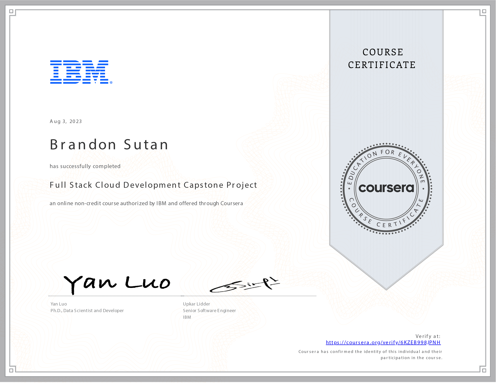

# Full Stack Cloud Development Capstone Project - Course Reflection

## Embracing the Summit: Reflecting on the Full Stack Cloud Development Capstone Project

Reflecting on my journey through the **Full Stack Cloud Development Capstone Project**, I am filled with accomplishment and excitement. This course has culminated all my efforts in the IBM Full Stack Software Developer Professional Certificate program, allowing me to showcase my skills in a real-world context.

## Building the Future: My Real-World Web Application

Over 16 hours, I embarked on a transformative journey of building a real-world web application. I had the privilege to apply and combine my expertise in JavaScript, React.js, Python, Node.js, and Express to craft a comprehensive solution that integrated front-end and back-end technologies.

## Taking Flight: Deployment on the Cloud

One of the highlights of this journey was deploying my Django full-stack web application on the cloud using containers and serverless technologies. Witnessing my creation come to life on a cloud platform was a moment of triumph, underscoring the relevance of the skills I've gained and their applicability in real-world scenarios.

## DevOps in Action: Embracing CI/CD Pipelines

Practicing DevOps principles through the employment of CI/CD pipelines was an invaluable experience. I learned the importance of automation, collaboration, and efficiency in the software development lifecycle, solidifying my ability to seamlessly bring projects from conception to deployment.

## A Journey Worth Celebrating

The Full Stack Cloud Development Capstone Project has not only deepened my technical expertise but has also given me the confidence to take on complex challenges in software development. This journey was a testament to my commitment and passion for mastering the art of full-stack cloud development.

Thank you for accompanying me on this transformative journey through the Full Stack Cloud Development Capstone Project. With the skills gained, I'm ready to contribute to the ever-evolving landscape of cloud-powered solutions and shape the future of technology! ☁️🚀
