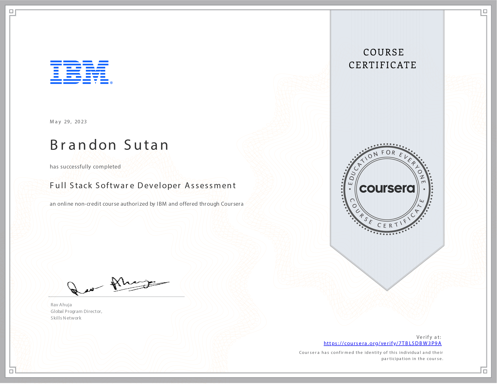

# Full Stack Software Developer Assessment - Course Reflection

## A Culmination of Mastery: Reflecting on the Full Stack Software Developer Assessment

As I conclude the **Full Stack Software Developer Assessment** course, I stand at the pinnacle of my journey through the IBM Full Stack Software Developer Professional Certificate program. This assessment has been a testament to my mastery of the diverse skills and knowledge acquired throughout this rigorous certification journey.

## Showcasing Proficiency Across the Full Stack

In these three intensive hours, I had the opportunity to demonstrate my proficiency across various facets of software development:

- **Mastery Demonstration:** The assessment showcased my mastery of full-stack, front-end, and back-end application development. I applied my understanding of the entire software development lifecycle, from ideation to deployment.

- **Comprehensive Knowledge:** I showcased a well-rounded understanding of the technologies that power modern software development by answering questions related to cloud computing, web development, HTML, CSS, JavaScript, GitHub, Python, Django programming, microservices, and containers.

- **Analyzing and Troubleshooting:** I exercised my skills in analyzing and troubleshooting software design, development, deployment, and operations. This experience solidified my ability to navigate complex technical challenges with confidence.

## A Sense of Accomplishment and Mastery

Completing the Full Stack Software Developer Assessment is not just a culmination of my learning; it's a reflection of my commitment to becoming a proficient software developer. The confidence gained from this assessment is a testament to the depth of knowledge I have acquired.

## Looking Ahead: A World of Opportunities

As I celebrate this milestone, I look forward to the vast opportunities. Armed with the skills, knowledge, and expertise I've honed throughout this professional certificate program, I am excited to embark on a fulfilling career journey in software development.

Thank you for joining me on this transformative journey through the Full Stack Software Developer Professional Certificate program. Together, we'll continue pushing the boundaries of software development and shaping the future of technology! 💻🌟
