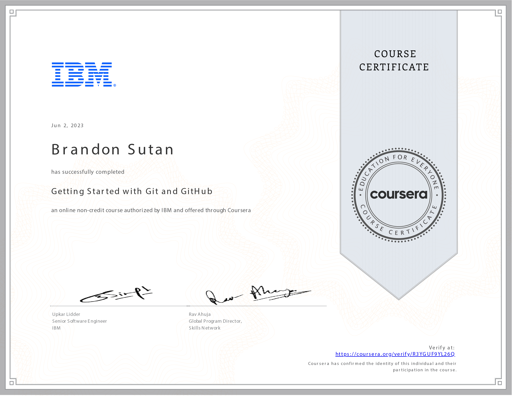

# Getting Started with Git and GitHub - Navigating the World of Collaborative Coding

## Embarking on the Git and GitHub Expedition: A Journey into Version Control

The voyage through **Getting Started with Git and GitHub** has illuminated the intricate realm of version control, collaborative coding, and DevOps practices. Through 8 hours of immersive learning, I've harnessed the power of Git and GitHub to establish a robust foundation for efficient and collaborative software development.

## Version Control Unveiled: A Catalyst for Collaboration

This course has been an eye-opening revelation of the significance of version control in software development. I've understood its pivotal role in facilitating collaborative coding, promoting seamless teamwork, and ensuring code integrity across diverse projects.

## Git Concepts Mastered: Repositories and Branches

Delving into Git's core concepts, I've gained a profound comprehension of repositories and branches as the cornerstones of distributed version control. The ability to create, manage, and navigate repositories and branches has empowered me to streamline my development workflow.

## Collaboration Amplified: Pull Requests and Merge Operations

Equipped with knowledge of pull requests (PRs) and merge operations, I've been able to contribute effectively to team projects. The course's guidance on performing PRs and managing merges has amplified my capacity to collaborate seamlessly with fellow developers.

## Crafting a Digital Portfolio: Showcasing Open-Source Excellence

The course's emphasis on building a portfolio by creating and sharing open-source projects on GitHub has proven invaluable. Contributing to real-world projects and displaying my coding prowess on a public platform enriched my professional profile and demonstrated my commitment to collaborative coding.

## Forge Ahead with Git and GitHub: A Future of Collaborative Excellence

As I reflect on the illuminating journey through the **Getting Started with Git and GitHub** course, I'm invigorated by the prospect of seamlessly navigating version control systems, collaborating with developers worldwide, and adhering to DevOps principles. Armed with this knowledge, I am poised to pioneer collaborative coding endeavors that will shape the future of software development.

## Connect and Collaborate

Thank you for joining me on this enlightening journey into the heart of version control and collaborative coding. As I continue my coding odyssey, I am inspired to foster innovation through seamless collaboration and code integrity, driven by the mastery of Git and GitHub.

