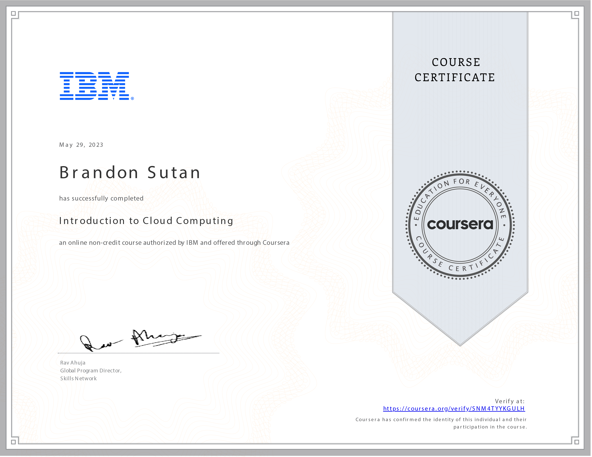

# Introduction to Cloud Computing - Course Reflection

## A Journey into Cloud Computing: Understanding the Future of Technology

As I reflect on completing the **Introduction to Cloud Computing** course, I am amazed by the transformative power of cloud technology and its profound impact on the computing world. This course has provided me with a comprehensive introduction to the fundamental concepts of cloud computing and has broadened my perspective on the future of technology.

## Exploring the Essentials of Cloud Computing

Throughout the 12-hour journey, I delved deep into the core principles of cloud computing:

- **Defining Cloud Computing:** I now understand cloud computing and its essential characteristics. I have grasped cloud technology's pivotal role in reshaping industries from history to its business case.

- **Unveiling Cloud Models:** The course unraveled the layers of cloud service models - IaaS, PaaS, SaaS, and the cloud deployment models - Public, Private, and Hybrid. I can now distinguish between these models and their respective components.

- **Emerging Cloud Trends:** The course provided insight into the future of cloud computing. I am now well-versed in emerging trends such as Hybrid Multicloud, Microservices, Serverless, Cloud Native, DevOps, and Application Modernization.

- **Exploring Cloud Platforms:** I have learned to navigate the offerings of popular cloud platforms, including AWS, Microsoft Azure, Google Cloud, IBM Cloud, and Alibaba Cloud. This familiarity empowers me to make informed decisions when choosing the right platform for various applications.

## Embracing the Potential of Cloud Technology

The course has equipped me with a foundational understanding of cloud computing, making me realize its potential to revolutionize industries across the globe. The blend of theoretical knowledge and practical insights has fueled my passion for exploring cloud technology's limitless possibilities.

## A Step Closer to the Future

Completing the **Introduction to Cloud Computing** course is just the beginning of my journey into cloud technology. Armed with the knowledge gained, I am excited to delve further into the intricacies of cloud architecture, application development, and integration and explore how cloud technology can drive innovation and efficiency.

Thank you for joining me on this exploration of cloud computing, and I look forward to the exciting future that lies ahead in the cloud-powered world! ☁️🚀
