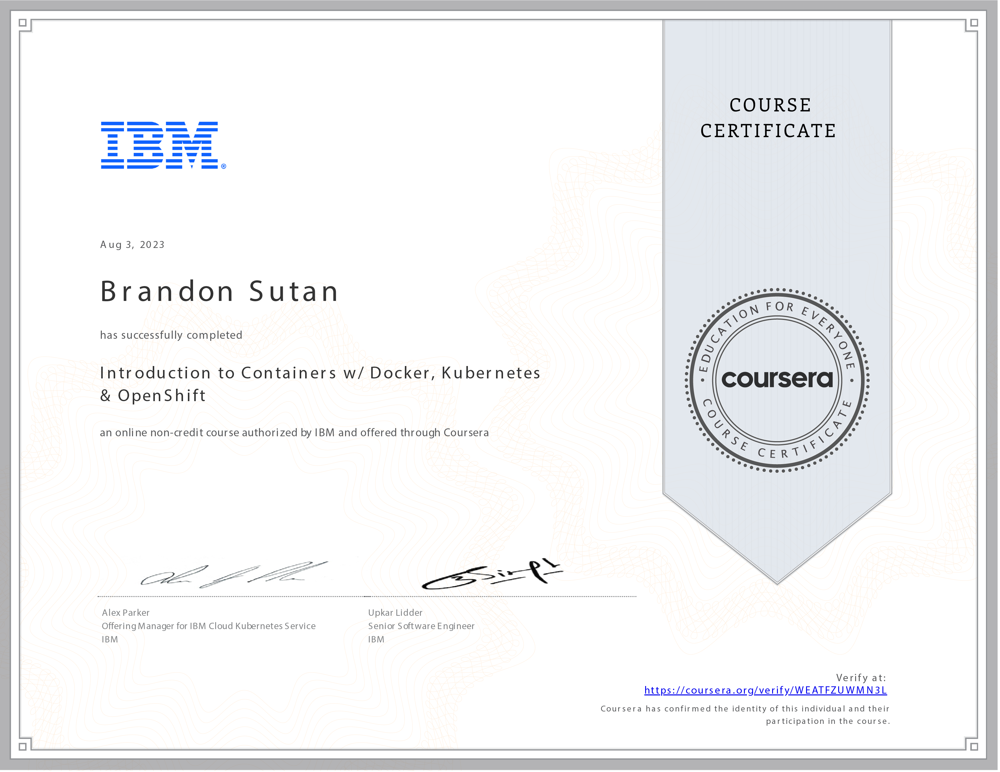

# Introduction to Containers w/ Docker, Kubernetes & OpenShift - Course Reflection

## Navigating the Cloud: Reflecting on Containers and Cloud Technologies

Completing the **Introduction to Containers w/ Docker, Kubernetes & OpenShift** course has been an enlightening journey through containerization and cloud-native technologies. Over 13 hours, I embarked on a transformative learning experience that revolutionized my application deployment and management approach.

## The Power of Containers: Agility and Portability

As I delved into the world of containers, I learned how they facilitate the rapid movement of applications across various environments. The course deepened my understanding of Docker, allowing me to encapsulate applications and their dependencies in lightweight, portable containers. This newfound agility and portability are invaluable assets for modern software deployment.

## Unleashing Cloud-Native Applications: Docker, Kubernetes, OpenShift, and Istio

The course's exploration of cloud-native application development using Docker, Kubernetes, OpenShift, and Istio has been a game-changer. I now possess the skills to build applications that harness the full potential of cloud technologies, ensuring optimal scalability, resilience, and flexibility.

## Mastering Kubernetes: Architecture and Management

Understanding Kubernetes architecture and its role as a container orchestration tool has been highlighted. Learning how to set up and manage a complete container management system using Kubernetes has expanded my capabilities as a developer. The insights gained have opened new avenues for efficiently managing applications at scale.

## The Art of Declarative Configuration: YAML Deployment

One of the course's standout features was teaching the art of declarative configuration using YAML deployment files. I gained proficiency in creating and leveraging these files to configure resources such as pods, services, and replicasets. This approach streamlines deployment and ensures consistency across environments.

## Embracing a Cloud-First Future

Completing the **Introduction to Containers w/ Docker, Kubernetes & OpenShift** course has positioned me at the forefront of the cloud-first revolution. With knowledge of containerization, orchestration, and declarative configuration, I am prepared to lead the charge in developing modern, scalable, and resilient applications.
Thank you for accompanying me on this exciting journey through containers, Kubernetes, and cloud-native technologies. With these skills in my arsenal, I look forward to shaping the future of application deployment and management in the cloud!
