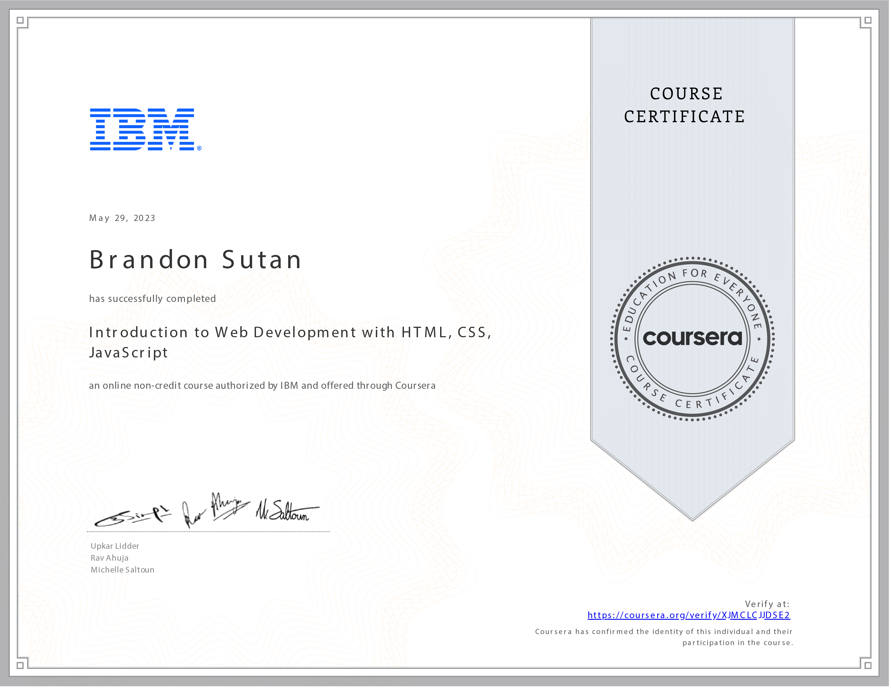

# Introduction to Web Development with HTML, CSS, JavaScript - Crafting Digital Experiences

## Unveiling the World of Web Development: Building Digital Landscapes

The expedition through **Introduction to Web Development with HTML, CSS, JavaScript** has been an immersive journey into the art of crafting digital experiences. Over 12 enriching hours, I've unraveled the intricacies of web development and harnessed the power of HTML, CSS, and JavaScript to shape the virtual landscapes that define our online world.

## Navigating the Web Application Development Ecosystem

This course has been a beacon of illumination into the expansive world of web application development. I've gained a comprehensive understanding of the roles of front-end and back-end developers, the significance of server-side operations, and the harmony of a whole stack architecture.

## Mastering Developer Tools: A Gateway to Innovation

From the foundations to the frontiers, I've navigated the arsenal of developer tools and integrated development environments (IDEs) that fuel the innovation behind web development. This knowledge has empowered me to leverage cutting-edge resources for optimal coding efficiency.

## Sculpting the Digital Canvas: HTML and CSS Mastery

The course's emphasis on creating and structuring web pages using HTML and styling them with CSS has equipped me with the tools to bring digital visions to life. I've harnessed the power of HTML to shape the content and wielded CSS to craft stunning visual experiences that captivate users.

## Breathing Life into Web Pages: Interactive JavaScript Magic

The enchanting realm of JavaScript has unfolded before me, enabling the development of dynamic web pages brimming with interactive features. Armed with JavaScript, I've embarked on a journey to engage users, respond to their interactions, and create seamless digital journeys.

## A Vision for the Future: Web Development Beyond Boundaries

As I conclude this transformative journey through **Introduction to Web Development with HTML, CSS, JavaScript**, I'm propelled by the vision of a digital landscape shaped by my skills. Armed with the mastery of front-end tools, I'm poised to create immersive user interfaces, forge interactive experiences, and contribute to the ever-evolving world of web development.

Thank you for joining me on this journey into the heart of web development. As I continue to innovate and craft digital landscapes, I am driven by the promise of creating compelling user experiences that redefine the boundaries of the virtual realm.

