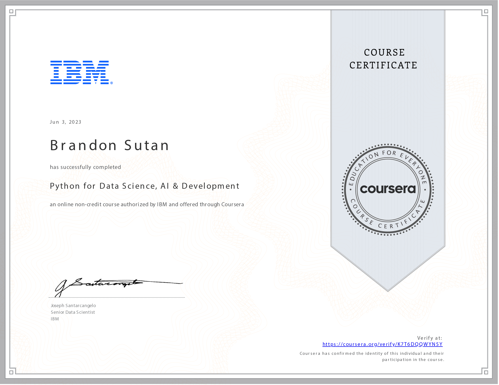

# Python for Data Science, AI & Development - Course Reflection

## Navigating Python's Vast Horizons: A Reflective Journey

Embarking on the **Python for Data Science, AI & Development** course has been a transformative experience that has unveiled Python's true power in data science, AI, and software development. Over 23 hours, I've dived deep into Python's core concepts and harnessed its capabilities to create intelligent applications and work with data.

## Mastering the Basics: Building a Strong Foundation

The course laid a solid foundation by enabling me to describe Python's basics, including data types, expressions, variables, and data structures. I now possess a robust understanding of Python's core components, allowing me to build upon this foundation in more complex projects.

## Unleashing Python's Logic: Branching, Loops, and Functions

Applying Python programming logic through branching, loops, functions, objects, and classes has been illuminating. This expertise empowers me to create efficient, structured, dynamic code that adapts to various scenarios and use cases.

## Harnessing Python Libraries: Pandas, Numpy, and Beautiful Soup

My proficiency in using essential Python libraries such as Pandas, Numpy, and Beautiful Soup opens doors to diverse applications. From data manipulation and analysis to web scraping, I can now wield these tools to extract insights, process data, and derive meaningful information.

## Web Data Access: APIs and Web Scraping in Jupyter Notebooks

One of the highlights of the course was learning how to access web data using APIs and perform web scraping within Jupyter Notebooks. This skill enables me to gather real-time data and extract valuable information from the web, contributing to my ability to create data-driven applications.

## Python's Realm of Possibilities: Beyond Data Science

Reflecting on my journey through the **Python for Data Science, AI & Development** course, I'm struck by the boundless potential Python offers. I can manipulate and analyze data effectively, and I'm also equipped to harness Python's power in software development, AI applications, and much more.

## Embracing a Python-Infused Future

Completing this course has ignited a spark within me to explore the vast landscape that Python encompasses. With my newfound skills, I'm prepared to create intelligent software, delve into data science endeavors, and continue my journey in Python-powered technology.

Thank you for joining me on this enlightening exploration of Python's multifaceted capabilities. As I step forward, I'm excited to contribute to the ever-evolving world of data science, AI, and software development, driven by the power of Python.
